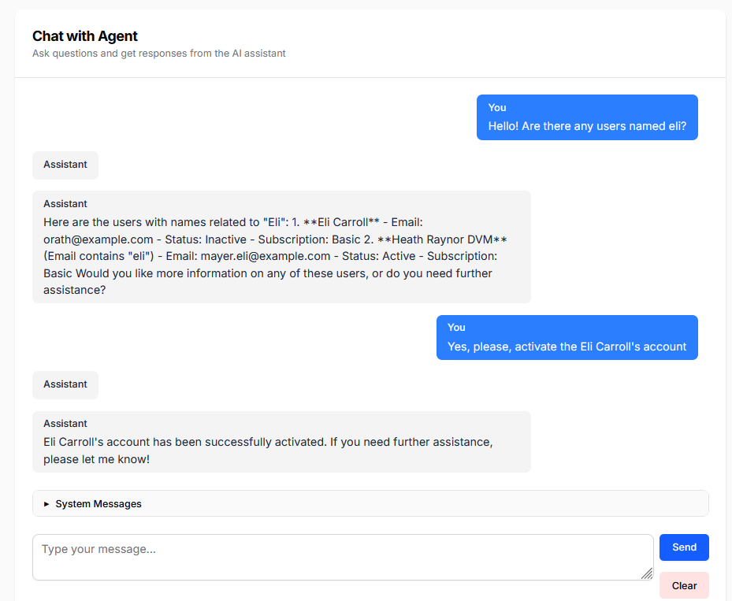

# Laravel User Manager Agent



A Laravel-based user management system with AI agent capabilities.

## Features

- User management (CRUD operations)
- Subscription management
- User activation/deactivation
- Password reset functionality
- Search and filter users
- AI-powered user management through natural language

## Prerequisites

- PHP >= 8.1
- Composer
- Node.js & NPM
- MySQL/PostgreSQL/SQLite (depending on your preference)
- Git

## Installation

1. **Clone the repository**
   ```bash
   git clone https://github.com/yourusername/punyapal-usermanager-agent.git
   cd punyapal-usermanager-agent
   ```

2. **Install PHP Dependencies**
   ```bash
   composer install
   ```

3. **Install NPM Dependencies**
   ```bash
   npm install
   ```

4. **Environment Setup**
   - Copy `.env.example` to `.env`
   - Generate application key
   ```bash
   cp .env.example .env
   php artisan key:generate
   ```

5. **Configure Database** (Optional)
   - Update `.env` with your database credentials:
     ```
     DB_CONNECTION=mysql
     DB_HOST=127.0.0.1
     DB_PORT=3306
     DB_DATABASE=your_database_name
     DB_USERNAME=your_database_username
     DB_PASSWORD=your_database_password
     ```

6. **Run Database Migrations & Seeders**
   ```bash
   php artisan migrate
   php artisan db:seed
   ```

7. **Add OpenAI API key in .env file**
   ```bash
   OPENAI_API_KEY="your_openai_api_key"
   ```

8. **Storage Link**
   ```bash
   php artisan storage:link
   ```

9. **Build Assets**
   ```bash
   npm run build
   # or for development
   npm run dev
   ```

10. **Start Development Server**
    ```bash
    php artisan serve
    ```
    Your application will be available at: http://localhost:8000

## Development

- Run tests:
  ```bash
  php artisan test
  ```

- Clear application cache:
  ```bash
  php artisan cache:clear
  php artisan config:clear
  php artisan route:clear
  php artisan view:clear
  ```

## License

This project is open-sourced software licensed under the [MIT license](https://opensource.org/licenses/MIT).
